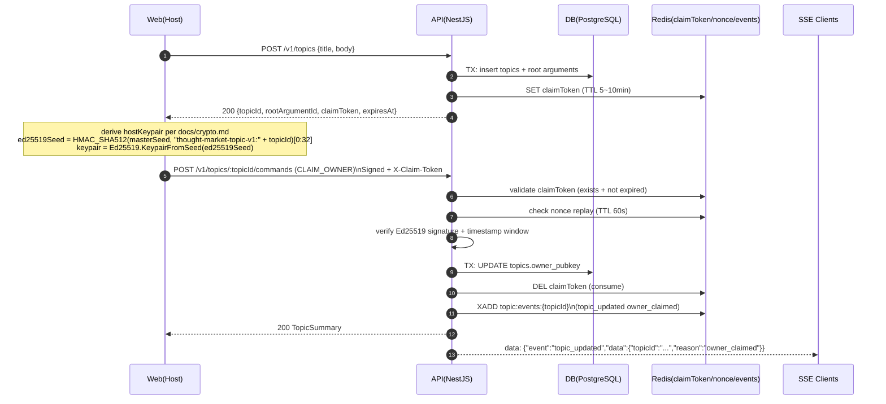
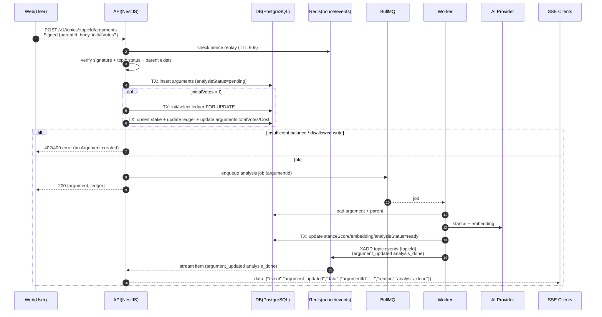
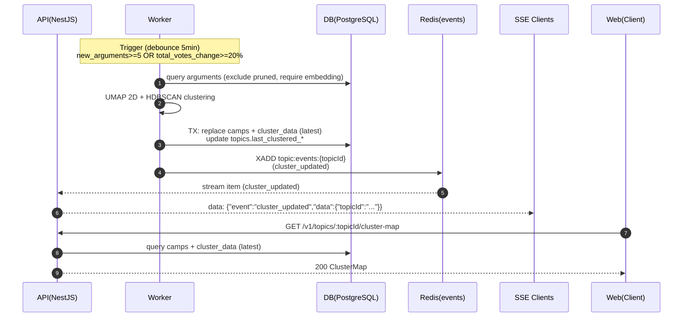

# 核心流程：时序图 / 流程图（v1.0）

本文档把 `docs/architecture.md` 与 `docs/api-contract.md` 中定义的“端到端核心流程”用 **Mermaid** 的时序图/流程图固化，便于前后端/Worker 对齐实现与验收。

## 0. 参与方与约定

- **Web**：`apps/web`（Next.js），包含 Key 派生、签名、缓存与 SSE 订阅逻辑
- **API**：`apps/api`（NestJS），包含鉴权、QV 事务、SSE 事件生产/补发
- **DB**：PostgreSQL（`docs/database.md` 定义 schema 与事务约束）
- **Redis**：claimToken、nonce 去重/幂等缓存、SSE Redis Stream
- **Worker**：BullMQ 消费者（AI 立场/embedding、聚类、报告生成等）
- **AI Provider**：外部 LLM/Embedding（仅 Worker 调用）

> Mermaid 渲染：GitHub / 大多数 Markdown 预览支持 ` ```mermaid ` 代码块；若你的预览器不支持，请在支持 Mermaid 的环境打开。

---

## 1. 创建 Topic + Host 认领（CLAIM_OWNER）

相关文档：`docs/architecture.md`「5.1 创建 Topic」与 `docs/api-contract.md`「3.1/3.2」。



---

## 2. Focus View 首屏加载 + SSE 失效通知（Entity Invalidation）

相关文档：`docs/architecture.md`「通信与实时性」与 `docs/api-contract.md`「3.4/3.5/3.12」。

```mermaid
flowchart TD
  A[打开 Topic 页面] --> B[GET /v1/topics/:topicId/tree?depth=3]
  A --> C[连接 SSE /v1/sse/:topicId<br/>携带 Last-Event-ID(可选)]
  B --> D[渲染 Focus View(左) + Dialogue Stream(右)]
  C --> E{收到 SSE event?}
  E -- argument_updated --> F[Invalidate: tree/children]
  E -- topic_updated --> G[Invalidate: topic/tree]
  E -- cluster_updated --> H[Invalidate: cluster-map]
  E -- reload_required --> I[全量刷新页面]
  F --> J[去抖(3s)后按需重新拉取]
  G --> J
  H --> J
  J --> D
  C --> K{断线?}
  K -- 是 --> L[浏览器自动重连<br/>带 Last-Event-ID] --> C
```

---

## 3. 发言（createArgument）+ 可选 initialVotes + AI 回填

相关文档：`docs/architecture.md`「5.2 发言」与 `docs/api-contract.md`「3.6」。



---

## 4. QV setVotes（投票/撤回）+ pruned/只读限制 + 幂等

相关文档：`docs/architecture.md`「5.3 QV 投票/撤回」与 `docs/api-contract.md`「3.7」。

```mermaid
sequenceDiagram
  autonumber
  participant U as Web(User)
  participant API as API(NestJS)
  participant Redis as Redis(idempotency/events)
  participant DB as DB(PostgreSQL)
  participant SSE as SSE Clients

  U->>API: POST /v1/arguments/:argumentId/votes<br/>Signed {targetVotes}
  API->>Redis: idempotency check (pubkey+nonce, 5min)
  alt nonce replay (cached)
    Redis-->>API: cached response
    API-->>U: 200 cached response
  else first time
    API->>DB: TX: lock argument + ledger + stake (FOR UPDATE)
    API->>DB: TX: validate topic.status (frozen/archived only allow decrease)
    API->>DB: TX: validate pruned (only allow targetVotes <= currentVotes)
    API->>DB: TX: compute deltaCost; ensure balance >= deltaCost
    API->>DB: TX: upsert/delete stake; update ledger; update argument totals
    API->>Redis: cache response by (pubkey+nonce, 5min)
    API->>Redis: XADD topic:events:{topicId}<br/>(argument_updated new_vote)
    API-->>U: 200 {previousVotes,targetVotes,deltaCost,ledger}
    API-->>SSE: data: {"event":"argument_updated","data":{"argumentId":"...","reason":"new_vote"}}
  end
```

---

## 5. Host Pruning + My Activity 资金找回（一键撤回）

相关文档：`docs/prd.md`「2.6 枯萎与资金清算 / 2.5 我的界面」与 `docs/api-contract.md`「3.2/3.9/3.10/3.7」。

```mermaid
flowchart TD
  subgraph Admin[Host 侧：隐藏节点]
    A[Host 点击 Prune] --> B[POST /v1/topics/:topicId/commands<br/>type=PRUNE_ARGUMENT]
    B --> C[普通公共读接口<br/>tree/children 不再返回该节点]
    B --> D[SSE argument_updated(pruned)]
  end

  subgraph My[用户侧：找回质押]
    E[打开 我的(My Activity)] --> F[读取本地参与过的 topicId 列表<br/>IndexedDB/LocalStorage]
    F --> G[POST /v1/user/batch-balance<br/>items 逐项签名]
    G --> H[选择某 Topic]
    H --> I[GET /v1/topics/:topicId/stakes/me<br/>列出我的质押(含 pruned 标记)]
    I --> J[一键撤回: 对每个 stake 调用 setVotes(0)]
    J --> K[POST /v1/arguments/:argumentId/votes<br/>targetVotes=0]
    K --> L[余额返还到该 Topic 的 Ledger]
  end
```

---

## 6. God View 聚类批处理（UMAP + HDBSCAN）与推送

相关文档：`docs/architecture.md`「5.4 阵营识别」与 `docs/api-contract.md`「3.11/3.12」。


