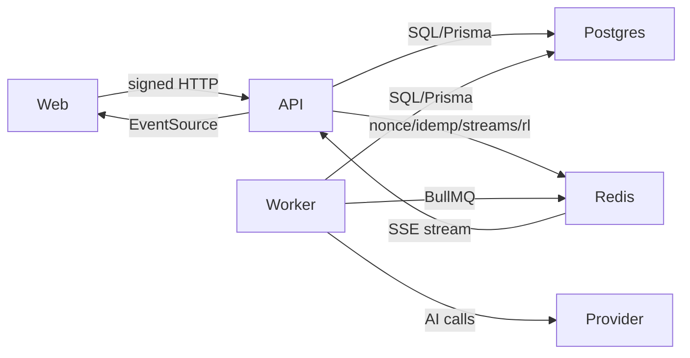

# Audit Step 01 — 威胁建模：资产清点、信任边界与攻击面

## 目标

- 用可复用、可审阅的方式产出 Threat Model（图 + 清单），指导后续所有扫描与人工审查的优先级。
- 明确本项目必须一直成立的安全目标：签名/防重放、`setVotes` 幂等与资金不变量、SSE 隐私、匿名性边界。

## 输入 / 前置条件

- 基线 commit 已固定（可执行：`git rev-parse HEAD`）。
- 已创建本次审计证据目录（若没有可在本 step 内创建，见下方命令）。
- 参考文档：
  - `docs/stage02/security-audit-plan.md`
  - `docs/stage01/roadmap.md`（0.x 硬约束）
  - `docs/stage01/api-contract.md`
  - `docs/stage01/architecture.md`
  - `PROJECT_REFERENCE.md`

## 操作步骤

### 1) 建立证据目录（若尚未建立）

```bash
BASELINE_SHA="$(git rev-parse HEAD)"
AUDIT_RUN_ID="${AUDIT_RUN_ID:-$(date -u +%Y%m%dT%H%M%SZ)}"
AUDIT_DIR="${AUDIT_DIR:-audit-artifacts/${AUDIT_RUN_ID}-${BASELINE_SHA:0:12}}"
mkdir -p "$AUDIT_DIR"
```

### 2) 资产清点（Assets）与信任边界（Trust Boundaries）

在 `$AUDIT_DIR/threat-model.md` 里至少列出：

- Web（浏览器端）/ API（NestJS）/ Worker（BullMQ consumer + HTTP health）/ Postgres（pgvector）/ Redis（nonce + streams + rate limit）/ 外部 AI Provider（可能）/ 部署平台（Coolify / Docker）。
- 信任边界：浏览器 ⇄ API、API ⇄ DB、API ⇄ Redis、Worker ⇄ DB/Redis、Worker ⇄ 外部 Provider。
- 数据分类：公开数据（topics/tree/children/cluster-map） vs 私密数据（ledger/me、stakes/me、batch-balance items、claimToken 等）。

建议用表格（便于审阅/签收）：

```md
| Asset | 数据/权限 | 暴露面 | 主要威胁 |
|---|---|---|---|
| API | 签名验签、写库 | HTTP | 鉴权绕过、注入、DoS |
...
```

### 3) 画数据流图（DFD）

建议用 Mermaid 直接写入文档，便于版本控制：

```md

```

### 4) 威胁枚举与优先级（STRIDE + 隐私）

至少覆盖（可对照 `docs/stage02/security-audit-plan.md` 关键目标）：

- Spoofing：伪造签名 headers、绕过验签、伪造 claim owner。
- Tampering：canonical message 不一致、raw body hash 不一致、PATH 含 query/mount 口径不一致。
- Repudiation：缺少可追溯审计记录（但注意匿名性边界）。
- Information Disclosure：SSE 泄露私密字段、日志泄密、跨 topic 关联（IP/指纹/稳定标识符）。
- DoS：写接口滥用、SSE 长连接、Redis/DB 资源耗尽。
- Elevation of Privilege：Host 命令越权、topic 状态限制绕过、pruned 增票绕过。
- 隐私（LINDDUN）：Linkability（跨 topic 关联）、Identifiability（泄露可识别信息）、Detectability（侧信道）。

输出格式建议（保证“可签收”）：

```md
### T-01 Nonce 重放导致写入重复
- 影响：...
- 证据/验证方式：...
- 受影响组件：API/Redis
- 现有控制：nonce TTL=60s，setVotes idemp=5min
- 建议：...
- 优先级：High
```

## 通过标准（独立可验证）

- [ ] `$AUDIT_DIR/threat-model.md` 存在，并包含：资产清点表、信任边界、DFD、威胁清单（至少 10 条）与优先级。
- [ ] 威胁清单能映射到后续审计步骤（例如签名/幂等/SSE/匿名性/风控/供应链）。

## 产物（证据）

- `audit-artifacts/<runId>-<sha>/threat-model.md`

